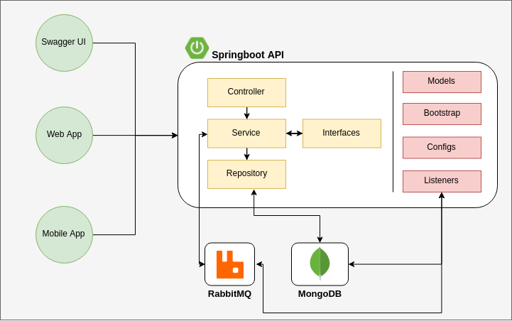

# Stock Exchange API

## Visão Geral da Arquitetura

## Bibliotecas usadas

### spring-boot-starter-amqp

- Biblioteca responsável por encapsular o funcionamento do Spring AMQP e RabbitMQ, facilitando seu uso com poucas configurações.

### spring-boot-starter-web

- Biblioteca contendo as funcionalidades básicas para executar/construir uma aplicação web, incluindo API's RESTful utilizando Spring MVC. Por padrão utiliza Tomcat como servidor web.

### lombok

- Biblioteca responsável por facilitar a vida do desenvolvedor, encapsulando diversas lógicas como Getters/Setters, instâncias de objetos utilizando o padrão `builder()`, além de outras funções.

### spring-boot-starter-test

- Pacote contendo as funcionalidades básicas para testes unitários (JUnit, Hamcrest e Mockito).

### springfox-swagger2

- Biblioteca responsável por habilitar o Swagger na sua aplicação. É através desta lib que o `.json` contendo as informações da sua API (endpoints, modelos, etc) é gerado. Porém ainda não possibilita uma interface amigável ao usuário.

### springfox-swagger-ui

- Esta biblioteca é um complemento da anterior [springfox-swagger2](#springfox-swagger2) utilizando o `.json` gerado para construir uma interface gráfica amigável para testes dos seus endpoints.

### spring-boot-starter-data-mongodb

- Biblioteca que encapsula o funcionamento/utilização de um banco de dados MongoDB.

### javax.mail

- Biblioteca que encapsula o envio de emails.

### spring-boot-starter-logging

- Biblioteca utilizada para facilitar a implementação de log da aplicação utilizando Logback.

### de.flapdoodle.embed.mongo

- Biblioteca utilizada por subir um banco MongoDB local para o correto funcionamento dos testes unitários.

## Como rodar a aplicação

### Pré-Requisitos

- [Docker](https://www.docker.com/get-started)
- [Docker-Compose](https://docs.docker.com/compose/)
- [Java](https://www.java.com/pt_BR/download/)
- [Maven](http://maven.apache.org/download.cgi)

### Steps

- Dentro da pasta `devops` existem 3 scrips:
  - build.sh
    - Responsável por buildar a aplicação e gerar o `.jar`
  - start-app.sh
    - Responsável por executar o comando `docker-compose up` que irá utilizar o arquivo `docker-compose.yml` na raiz do projeto para subir todos os containers necessários para o correto funcionamento da aplicação, sendo eles:
      - MongoDB
      - RabbitMQ
      - Dockerfile da API Springboot em questão
  - stop-app.sh
    - Responsável por executar o comando `docker-compose down` que interrompe a execução da aplicação, removendo todos os containers mencionados acima.
- Antes de iniciar a aplicação através do comando `./devops/start-app.sh`, altere o arquivo `EmailSender.java` com suas informações de e-mail para que seja possível simular o mecanismo adequadamente.
- Uma vez que a aplicação está sendo executada, basta acessar o endereço `http://localhost:8080/swagger-ui.html#` para visualizar todos os endpoints disponívels pela API e testar suas funções.
- Caso queira, também é possível acessar o gerenciador do RabbitMQ no endereço `http://localhost:15672` com o usuário e senha sendo, respectivamente, `guest:guest`.